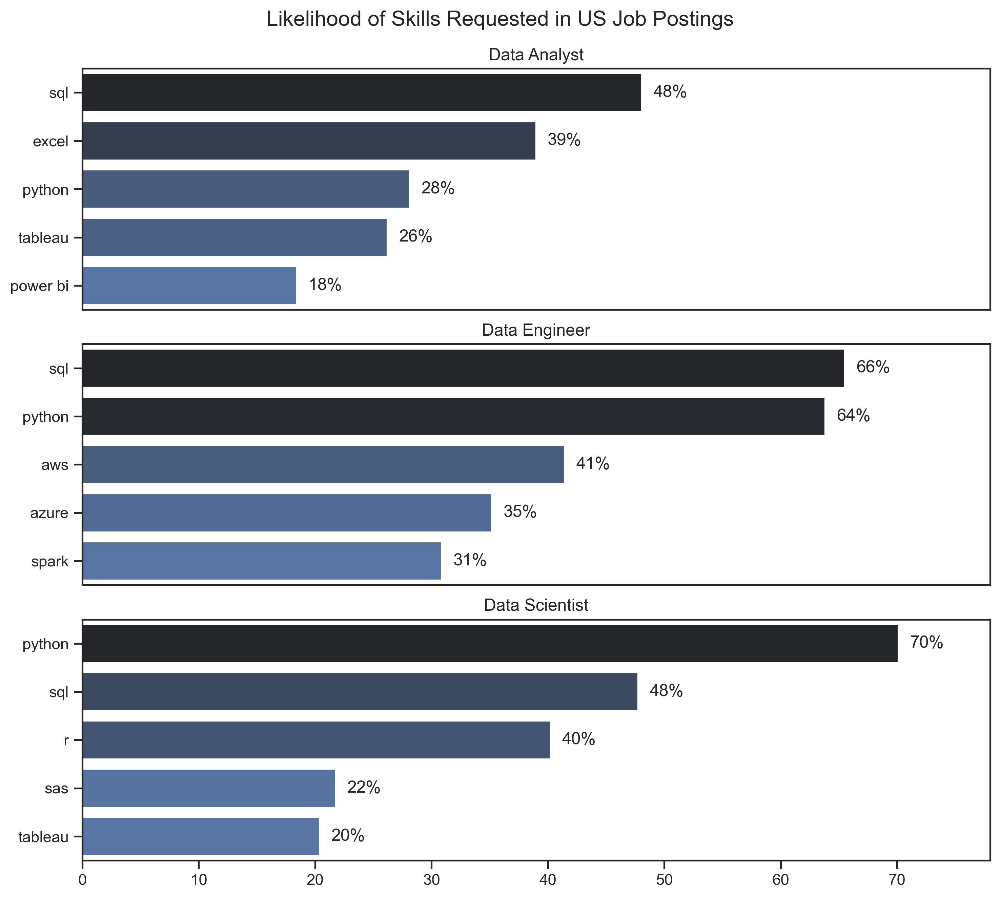
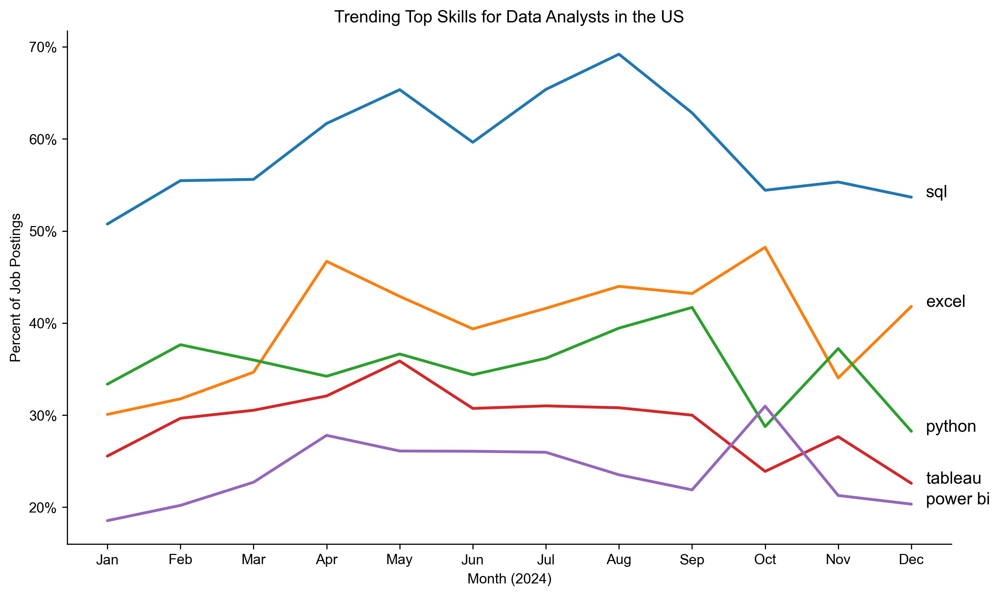
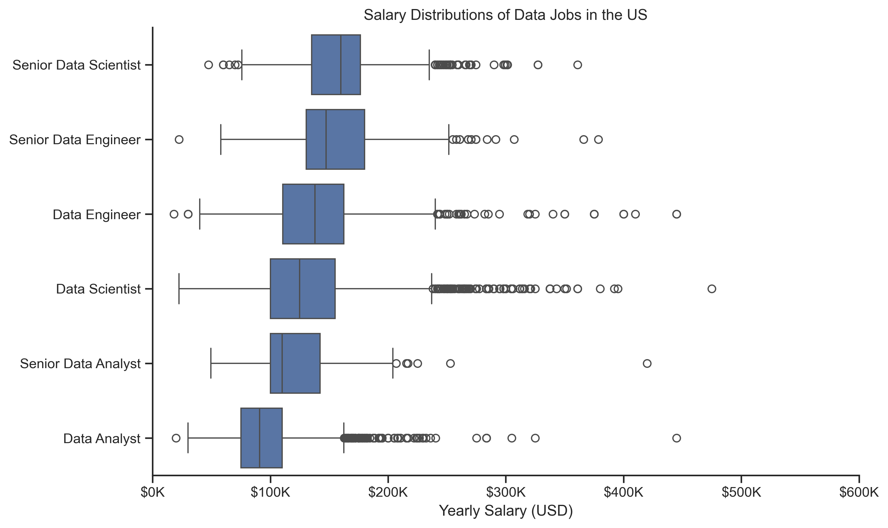
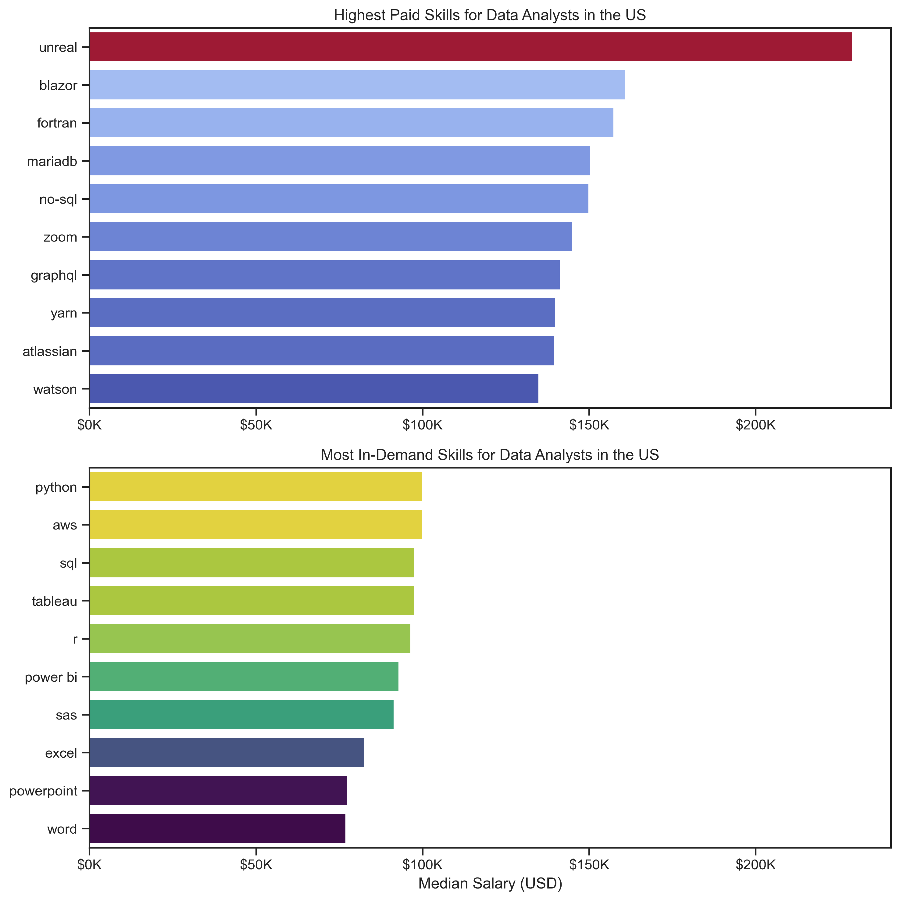
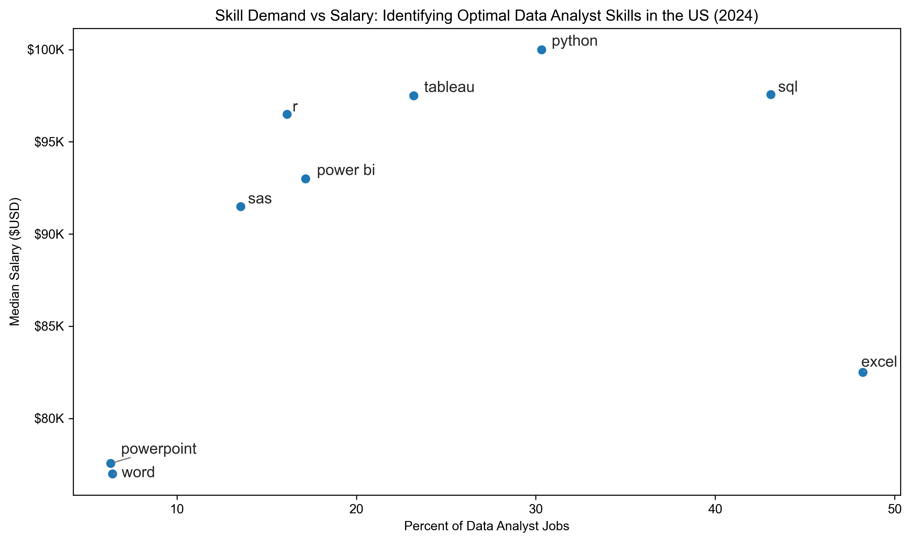
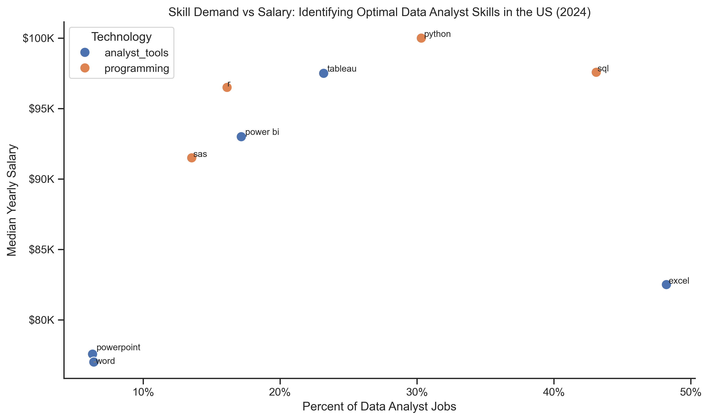

# Python Analysis of Data Analyst Job Market Trends

## 📊 Introduction

This project explores the **data analyst job market** using Python as the primary analytical tool.
The goal is to uncover:

* 💰 The **highest-paying jobs** for data analysts
* 🔥 The **most in-demand skills** across different data roles
* 📈 Skills that **trend over time** throughout the year
* 💡 The **optimal skills to learn** — balancing high demand with high pay

By leveraging Python's powerful data analysis libraries including Pandas, Matplotlib, and Seaborn, I transformed raw job posting data into **actionable insights**. These findings can help guide **career development decisions**, inform **skill-building strategies**, and provide a clearer picture of the evolving data analytics landscape.

---

## 🎯 Background

The inspiration for this project came from a desire to answer:

> *What skills should I prioritize to maximize both employability and salary potential in data analytics?*

To explore this, I focused on:

1. **The most demanded skills for the top 3 most popular data roles**
2. **Trends of in-demand skills for Data Analysts**
3. **Salary potential of jobs and skills for Data Analysts**
4. **The most optimal skills to learn for Data Analysts**

The dataset, provided by [Luke Barousse's Python Course](https://lukebarousse.com/python), includes job postings with **title, company, location, salary, schedule type, posting date, and associated skills**. 

> While the dataset is global, this project **focuses exclusively on US positions**, enabling a comprehensive analysis of trends, demand, and compensation in the US data analytics landscape using Python’s data manipulation and visualization capabilities.

---

## 🛠️ Tools I Used

This project showcased modern Python data analysis tools and libraries:

* **Python** – the backbone of the analysis, used for data manipulation, analysis, and visualization
* **Pandas** – essential for data manipulation, cleaning, and analysis
* **Matplotlib** – used for creating foundational data visualizations
* **Seaborn** – provided enhanced statistical visualizations
* **Jupyter Notebooks** – interactive environment for combining code, visualizations, and narrative
* **Visual Studio Code** – development environment for managing notebooks and scripts
* **Git & GitHub** – version control and project hosting

---

## 🚀 Getting Started

### Prerequisites

- Python 3.11 or higher
- Conda (recommended) or pip

### Installation

1. **Clone the repository**
   ```bash
   git clone https://github.com/NadiaRozman/Python_Data_Analysis_Project.git
   cd Python_Data_Analysis_Project
   ```

2. **Set up the environment**

   **Option 1: Using Conda (Recommended)**
   ```bash
   conda env create -f environment.yml
   conda activate python_data_analysis
   ```

   **Option 2: Using pip**
   ```bash
   pip install -r requirements.txt
   ```

3. **Launch Jupyter Notebook**
   ```bash
   jupyter notebook
   ```

4. **Open and run the notebooks** in the `notebooks/` directory in the following order:
   - `1_EDA_Data_Science_Jobs.ipynb`
   - `2_Skills_Demand.ipynb`
   - `3_Skills_Trend.ipynb`
   - `4_Salary_Analysis.ipynb`
   - `5_Optimal_Skills.ipynb`

---

## 🔎 The Analysis

Each Jupyter notebook in this project tackled specific questions about the data analyst job market:

### 1️⃣ What are the most demanded skills for the top 3 most popular data roles?

To identify the most in-demand skills for the top three data roles, I filtered job postings for Data Analysts, Data Engineers, and Data Scientists, then calculated the likelihood of each skill appearing in job postings.

**View my notebook with detailed steps here:** [2_Skills_Demand.ipynb](notebooks/2_Skills_Demand.ipynb)

**Key Insights:**

  
*Bar graph visualizing the likelihood of skills being requested in US job postings for Data Analysts, Data Engineers, and Data Scientists.*
> All analyses and visualizations are based on the US-focused subset of the global dataset.

- **SQL** is the most fundamental skill across all three roles, appearing in 48% of Data Analyst jobs, 66% of Data Engineer jobs, and 48% of Data Scientist jobs.
- **Python** is highly versatile and critical, especially for Data Scientists (70%) and Data Engineers (64%), while appearing in 28% of Data Analyst positions.
- **Data Engineers** require more specialized technical skills like AWS (41%), Azure (35%), and Spark (31%), reflecting the infrastructure-focused nature of the role.
- **Data Analysts** rely heavily on traditional tools: Excel (39%) and Tableau (26%) are core requirements alongside SQL.
- **Data Scientists** show strong demand for programming (Python 70%, SQL 48%, R 40%) and some analytics tools (SAS 22%, Tableau 20%).

---

### 2️⃣ How are in-demand skills trending for Data Analysts?

To understand how skill demand evolves throughout the year, I filtered the dataset for data analyst positions and examined monthly trends for the top five skills.

**View my notebook with detailed steps here:** [3_Skills_Trend.ipynb](notebooks/3_Skills_Trend.ipynb)

**Key Insights:**

  
*Line graph visualizing the trending top skills for data analysts in the US throughout 2024.*
> All analyses and visualizations are based on the US-focused subset of the global dataset.

- **SQL** remains the most consistently demanded skill throughout the year, peaking around August at nearly 70%, though it shows a gradual decline toward year-end, settling around 53%.
- **Excel** shows the most dramatic growth, starting at 30% in January and surging to 48% by October, then dropping to 34% in November before rising to 42% in December.
- **Python** maintains relatively stable demand between 28-42%, with a notable spike in September (42%) before declining to 28% by December.
- **Tableau** demonstrates consistent demand around 23-31% throughout most of the year, with slight fluctuations and ending at 23% in December.
- **Power BI** shows the most stable trend line, hovering between 18-30%, with a gentle upward trajectory and slight dip toward year-end at 20%.

The data suggests **seasonal variations** in skill demand, with SQL and Excel showing the most volatility, while visualization tools (Tableau and Power BI) maintain more consistent demand patterns.

---

### 3️⃣ How well do jobs and skills pay for Data Analysts?

To understand salary distributions and identify which skills command the highest pay, I analyzed median salaries across different data job titles and examined compensation for specific skills.

**View my notebook with detailed steps here:** [4_Salary_Analysis.ipynb](notebooks/4_Salary_Analysis.ipynb)

**Key Insights:**

#### Salary Distributions by Job Title

  
*Box plot visualizing the salary distributions for the top 6 data job titles.*
> All analyses and visualizations are based on the US-focused subset of the global dataset.

- **Senior Data Scientist** and **Senior Data Engineer** roles command the highest median salaries, with ranges extending beyond $200K, showcasing the premium placed on seniority and specialized technical expertise.
- **Data Scientist** positions show wide salary variance with many outliers reaching $250K+, indicating significant pay differences based on experience, company, and specialization.
- **Senior Data Analyst** positions show a more concentrated salary range around $100K-$150K with fewer extreme outliers compared to engineering and science roles.
- **Data Analyst** entry-level positions have the most concentrated salary distribution, primarily clustering between $75K-$125K, with some outliers extending to $175K.
- All roles show positive skew with outliers on the higher end, suggesting top performers and specialized positions can command significantly higher compensation.

#### Highest Paid & Most Demanded Skills

  
*Two bar graphs: Top graph shows the highest paid skills; bottom graph shows the most in-demand skills for data analysts.*
> All analyses and visualizations are based on the US-focused subset of the global dataset.

**Highest Paid Skills:**
- **Specialized and niche tools** dominate the top-paying skills: Unreal ($230K+), Blazor, Fortran, MariaDB, and NoSQL all command salaries around $160K-$180K.
- Skills like **Zoom, GraphQL, Yarn, and Atlassian** offer strong compensation ($140K-$155K), reflecting the value of collaboration tools and modern development practices.
- Even **Watson** (IBM's AI platform) appears in the top 10, indicating AI/ML skills command premium pay.

**Most In-Demand Skills:**
- **Python, AWS, and SQL** lead demand, with Python and AWS slightly ahead, each appearing in roughly equal proportions of job postings (~$100K median salary).
- **Tableau** remains highly demanded among analysts, positioned similarly to SQL and R in frequency.
- **Power BI, SAS, and Excel** round out the core toolkit, all showing demand levels around $85K-$95K median salary.
- Surprisingly, **PowerPoint and Word** still appear in demand lists, though at lower salary levels (~$77K), reflecting communication skill requirements.

---

### 4️⃣ What are the most optimal skills to learn for Data Analysts?

To identify the most strategic skills to learn, I combined demand data with salary information, looking for skills that offer both strong job prospects and competitive compensation.

**View my notebook with detailed steps here:** [5_Optimal_Skills.ipynb](notebooks/5_Optimal_Skills.ipynb)

**Key Insights:**

  
*Scatter plot visualizing the most optimal skills (high-paying and in-demand) for data analysts in the US.*
> All analyses and visualizations are based on the US-focused subset of the global dataset.

- **SQL and Python** are the **highest-value skills**, appearing in approximately 50% and 32% of job postings respectively, while offering strong salaries around $97K-$100K. These represent the optimal combination of ubiquity and compensation.
- **Tableau** strikes an excellent balance, appearing in about 28% of jobs with a competitive salary around $98K, making it a highly strategic visualization skill to master.
- **R** offers strong salary potential (~$97K) while appearing in roughly 18% of positions, positioning it as a valuable complementary skill to Python.
- **Power BI** balances moderate demand (~18% of jobs) with solid compensation (~$93K), making it a practical alternative or complement to Tableau.
- **Excel**, despite appearing in approximately 50% of positions (tied with SQL), offers lower compensation (~$83K), suggesting it's a necessary baseline skill but doesn't drive premium salaries.
- **SAS** shows moderate demand (~15%) with respectable pay (~$92K), indicating value for analysts in specific industries (finance, healthcare, pharmaceuticals).
- **Word and PowerPoint** represent baseline communication skills with minimal salary impact (~$77K), appearing in <10% of positions—necessary but not differentiating.

  
*Scatter plot with color coding distinguishing between programming skills (orange) and analyst tools (blue).*
> All analyses and visualizations are based on the US-focused subset of the global dataset.

When we separate **programming skills** (orange) from **analyst tools** (blue), a clear pattern emerges:

- **Programming skills (Python, SQL, R, SAS)** cluster in the higher salary range ($92K-$100K) and show varying demand levels, with SQL and Python being most prevalent.
- **Analyst tools (Tableau, Power BI, Excel, PowerPoint, Word)** span a wider salary range ($77K-$98K), with Tableau leading the pack in both demand and compensation among tools.
- The most **optimal career strategy** combines foundational programming (SQL + Python) with strong visualization capabilities (Tableau or Power BI).
- Excel remains ubiquitous but should be viewed as a baseline requirement rather than a salary differentiator.

---

## 📚 What I Learned

Through this project, I significantly enhanced both my **technical Python skills** and **analytical thinking**:

* 🐍 **Advanced Python Programming** – mastered Pandas for complex data manipulation, filtering, and transformation operations.
* 📊 **Data Visualization** – created publication-quality visualizations using Matplotlib and Seaborn with custom styling and color schemes.
* 🔍 **Analytical Thinking** – developed the ability to formulate business questions and translate them into data analysis workflows.
* 🧹 **Data Cleaning** – learned techniques for handling missing data, inconsistent formats, and filtering datasets for specific analyses.
* 💻 **Jupyter Notebooks** – became proficient in creating clear, reproducible data analysis workflows with markdown documentation.
* 📈 **Statistical Analysis** – applied statistical concepts like percentiles, medians, and distributions to understand salary data.
* 🔄 **Version Control** – used Git and GitHub effectively to manage project iterations and showcase my portfolio.

---

## 📈 Insights

Here's a summary of what the analysis revealed:

1. **SQL is non-negotiable** – appearing in nearly 50% of Data Analyst positions and across all data roles, it's the universal foundation skill.

2. **Programming separates good from great** – Python and R command higher salaries ($97K-$100K) compared to tool-only skillsets.

3. **Skill demand is seasonal** – SQL peaks mid-year while Excel surges in Q4, suggesting strategic timing for skill development and job searching.

4. **Specialization drives premium pay** – niche skills like Unreal, Blazor, and MariaDB command $160K+ salaries, though at lower demand.

5. **Visualization is table stakes** – Tableau and Power BI appear in 18-28% of jobs, making them essential for modern analysts.

6. **Senior roles pay significantly more** – Senior Data Scientists and Engineers command $150K-$200K+ compared to $75K-$125K for entry-level analysts.

7. **The optimal path balances demand and pay** – Focus on SQL + Python + Tableau/Power BI for the best combination of job opportunities and compensation.

8. **Cloud skills are emerging** – AWS appearing in top-demand lists signals the growing importance of cloud platforms in analytics.

9. **Communication tools have limited impact** – While Word and PowerPoint appear in job postings, they don't drive salary differentiation.

10. **Wide variance exists within roles** – Data Scientist salaries range from $100K to $300K+, emphasizing the importance of specialization and experience.

---

## ✅ Conclusion

This Python data analysis project revealed the dynamic nature of the data analyst job market and the critical skills needed to succeed. The analysis confirmed that while **SQL forms the absolute foundation**, advancing into **programming (Python) and visualization tools (Tableau)** offers the greatest balance of employability and compensation.

### Key Takeaways for Aspiring Data Analysts:

**📌 Foundation Skills (Start Here):**
- SQL – appears in 50% of positions, ~$97K median salary
- Excel – appears in 50% of positions but focus on it as baseline, not differentiator

**📌 Differentiating Skills (Build These Next):**
- Python – 32% of jobs, ~$100K salary, highest versatility
- Tableau or Power BI – 18-28% of jobs, $93K-$98K salary
- R – 18% of jobs, ~$97K salary, strong for statistical analysis

**📌 Advanced Specialization (For Premium Roles):**
- Cloud platforms (AWS) – growing demand
- Statistical tools (SAS) – industry-specific value
- Niche technical skills – command premium but lower demand

**📌 Career Progression Path:**
- Entry-level: Master SQL + Excel + one visualization tool → $75K-$100K
- Mid-level: Add Python + advanced visualization → $90K-$120K  
- Senior-level: Specialize in programming + cloud/big data → $120K-$200K+

### Strategic Recommendations:

1. **Time your learning** – Consider seasonal trends when planning skill development
2. **Stack complementary skills** – SQL + Python + Tableau is more valuable than any single skill
3. **Don't chase niche skills early** – Focus on high-demand foundational skills first
4. **Invest in programming** – Python and R consistently command higher salaries
5. **Build a portfolio** – Projects like this demonstrate practical application of skills

This project demonstrates how Python's powerful data analysis ecosystem can transform raw data into career-guiding insights. The skills I developed here—from data manipulation to visualization to analytical thinking—are directly applicable to real-world data analyst roles.

---

### ✨ Created by Nadia Rozman | January 2026

**📂 Project Structure**
```
Python_Data_Analysis_Project/
│
├── images/                                  
│   ├── 1_Likelihood_of_Skills_Requested_in_US_Job_Postings.png
│   ├── 2_Trending_Top_Skills_for_Data_Analysts_in_the_US.png
│   ├── 3_Salary_Distributions_of_Data_Jobs_in_the_US.png
│   ├── 4_Highest_Paid_and_Most_In_Demand_Skills_for_Data_Analysts_in_the_US.png
│   ├── 5_Most_Optimal_Skills_for_Data_Analysts.png
│   └── 6_Most_Optimal_Skills_for_Data_Analysts_with_Tech.png
│
├── notebooks/                              
│   ├── 1_EDA_Data_Science_Jobs.ipynb
|   ├── 2_Skills_Demand.ipynb
│   ├── 3_Skills_Trend.ipynb
│   ├── 4_Salary_Analysis.ipynb
│   └── 5_Optimal_Skills.ipynb
│
├── requirements.txt                        
├── environment.yml                         
└── README.md                              
```

**🔗 Connect with me**
- GitHub: [@NadiaRozman](https://github.com/NadiaRozman)
- LinkedIn: [Nadia Rozman](https://www.linkedin.com/in/nadia-rozman-4b4887179/)

**⭐ If you found this project helpful, please consider giving it a star!**
